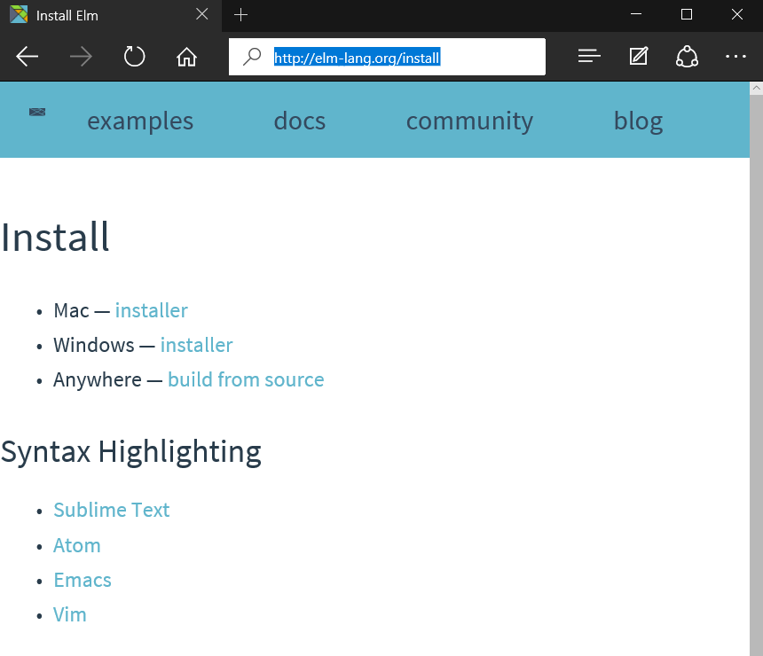
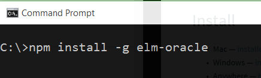
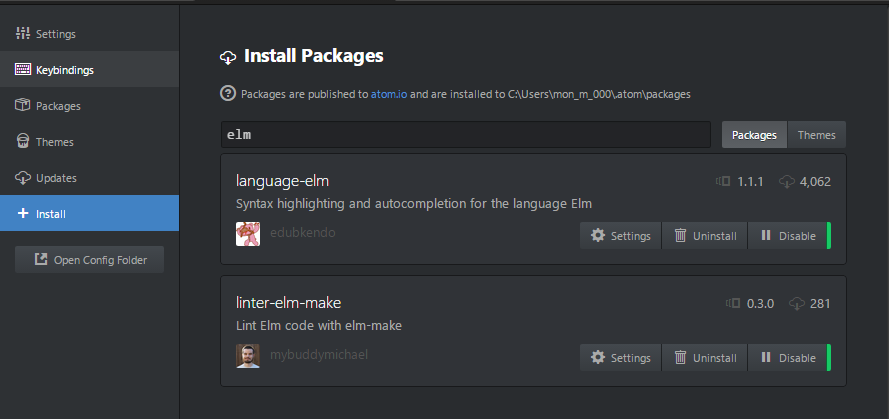
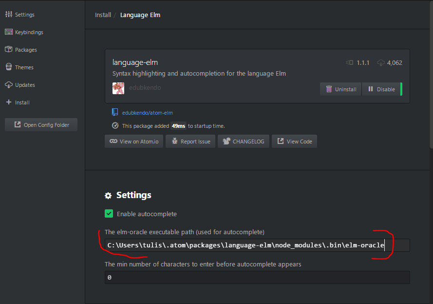
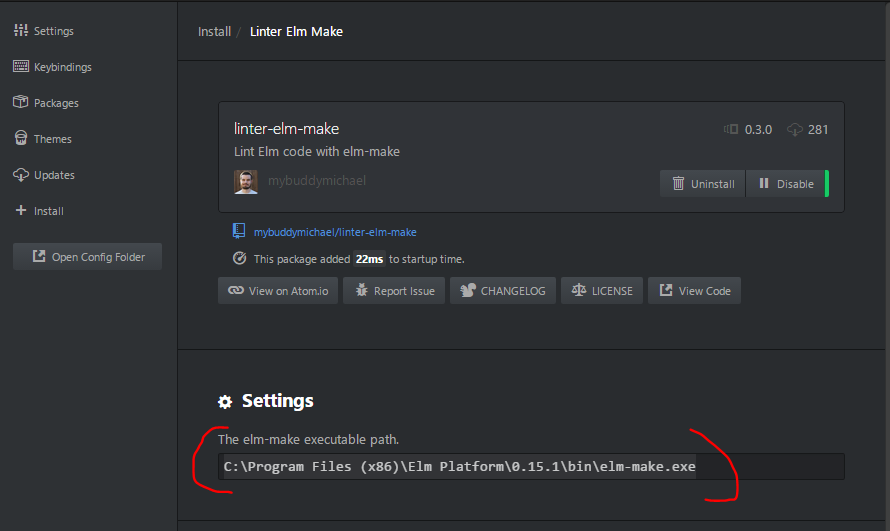
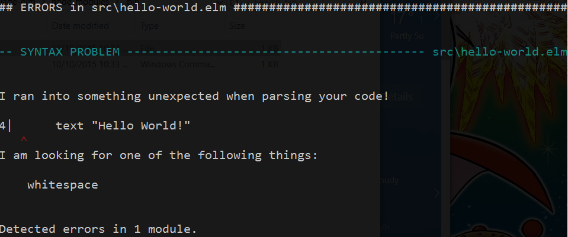
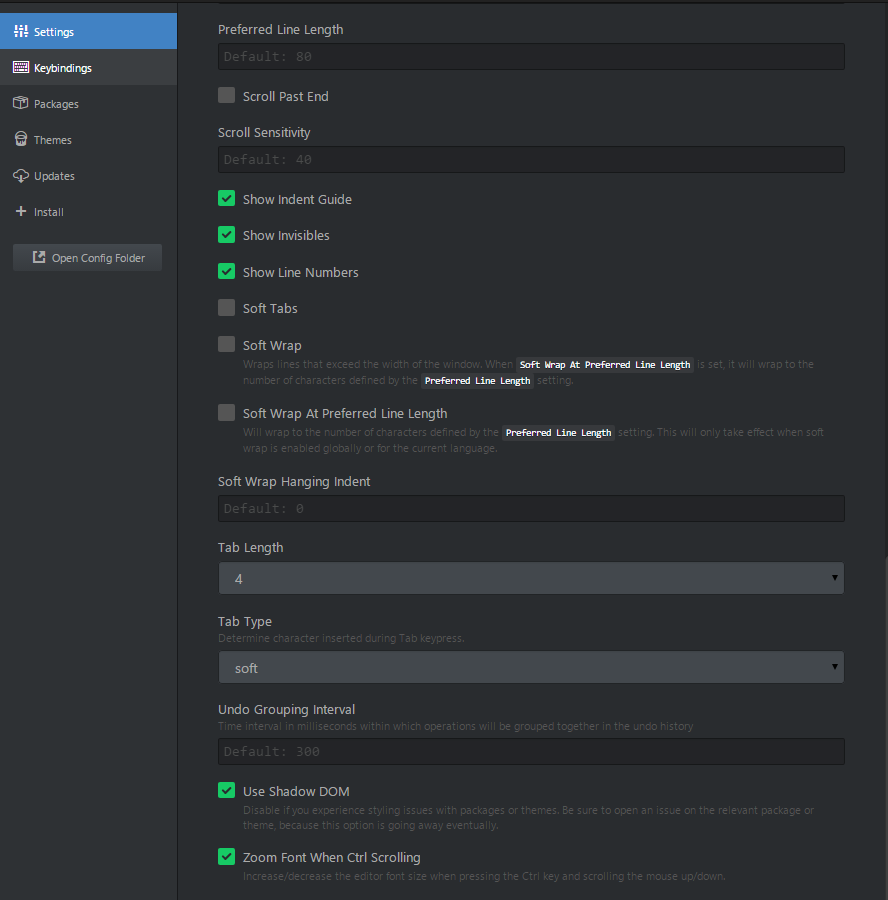

 **Setup elm environment in Windows**

1. Go to **[Install Elm page](http://elm-lang.org/install)** to download the installer for Windows

    
2. Next, run and install it in Administrator mode
3. Make sure that Atom has been installed in your machine, otherwise click **[here](https://atom.io/)** to install it
4. Open command line (cmd)
5. Enter the following command line

    
6. Copy the following path

    ```
        C:\Users\tulis\.atom\packages\language-elm\node_modules\.bin\elm-oracle
    ```
    **NOTE:** The above path is relative to your User directory path, in this case, it is tulis directory.
7. Open atom editor
8. Open Settings through Command Pallete (Ctrl + Shift + P), then type Settings
9. Install both **language-elm** and **linter-elm-make**

    
10. Open **language-elm** settings and paste the copied path from step number 6 to enable the auto-complete feature

    
11. To enable elm linter, copy the following path

    ```
        C:\Program Files (x86)\Elm Platform\0.15.1\bin\elm-make.exe
    ```
12. Open **linter-elm-make** settings and paste the copied path from previous step

    
13. Lastly, make sure that Atom is using **Soft** Tab type (personally, I use 4 spaces), otherwise Elm compiler will throw following exception:

    

    
